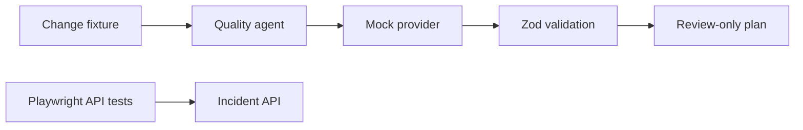

# Architecture

The first iteration separates deterministic product behavior from probabilistic AI behavior.

## Trust boundaries

- Change descriptions are untrusted input and must be parsed.
- Provider output is always `unknown` until it passes the output schema.
- The agent cannot write code, execute arbitrary commands or publish comments.
- Human approval is part of the output contract, not a convention.

## Why mock-first?

CI needs stable results. The deterministic provider lets us test orchestration, contracts and failure behavior before introducing model variance, credentials, cost and rate limits.

## Next architectural increment

The next phase adds a tool registry and read-only execution policy. MCP is introduced only after the underlying tools have direct automated tests.
