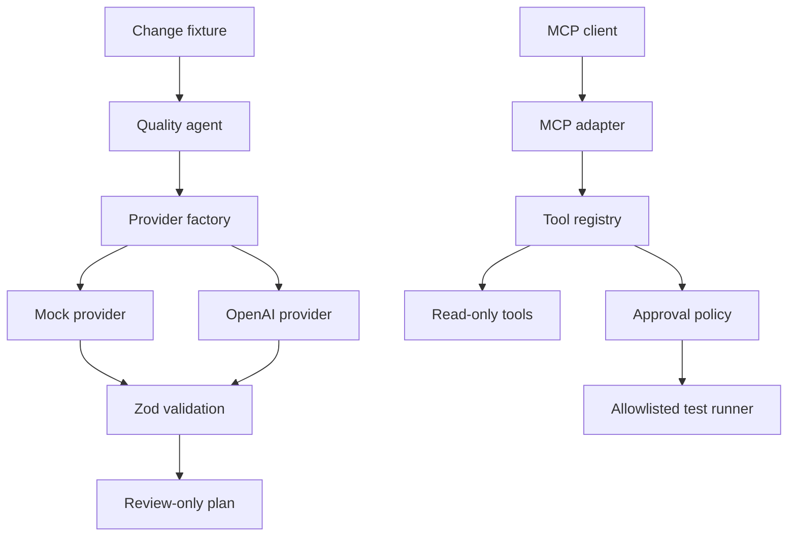

# Architecture

The design separates deterministic product behavior from probabilistic AI behavior. Both providers share one contract and one validation boundary.

## Trust boundaries

- Change descriptions are untrusted input and must be parsed.
- Provider output is always `unknown` until it passes the output schema.
- The live provider is disabled unless `AI_PROVIDER=openai` and both required values exist.
- Change context is placed in a data block and explicitly treated as untrusted.
- The agent cannot write code, execute arbitrary commands or publish comments.
- Human approval is part of the output contract, not a convention.
- MCP is only a transport adapter; direct tests cover the registry before protocol exposure.
- Tools have fixed names and schemas. Callers cannot supply paths or commands.
- Side-effecting calls require evidence matching a server-side approval token.
- Process execution uses fixed argument arrays with `shell: false` and a timeout.

## Why mock-first?

CI needs stable results. The deterministic provider lets us test orchestration, contracts and failure behavior before introducing model variance, credentials, cost and rate limits.

## Evaluation boundary

`src/evals` measures schema compliance, risk accuracy and expected test selection against controlled fixtures. CI evaluates the mock provider so failures are attributable and free. This is a baseline, not evidence that a live model is universally correct.

The adversarial suite adds explicit attacks and safety regressions: embedded instructions, missing or forged approval, malformed provider output, incorrect test selection and secret leakage. Its JSON report is uploaded by CI as evidence. Because CI uses deterministic components, cost is zero and latency is diagnostic rather than representative of a live model.

## Tool boundary

`ToolRegistry` validates both sides of each invocation. `list_tests` searches only the repository's fixed `tests/unit` and `tests/api` directories, skips symbolic links and never executes a test. `inspect_change` accepts the same validated change contract used by the agent. `execute_tests` accepts only `unit` or `api`, then maps that enum to a fixed npm script after approval.

## Lifecycle boundary

Hooks observe validated calls before and after execution and receive normalized errors. Telemetry redacts sensitive keys and bearer tokens. Approval happens before the `before` hook and before the runner, so denied calls cannot reach side effects. Errors expose a stable code and safe message instead of raw provider, validation or process details.

## Evidence boundary

`evidence/v1/contract.json` is the stable, reviewable interface between this repository and the SDET portfolio. CI verifies the generated adversarial report against that contract and uploads both files as the `quality-evidence-v1` artifact. Consumers keep a reviewed snapshot of the contract, so they can validate the claims without credentials, a paid model or cross-repository write access.

The contract records the source workflow, report version, deterministic provider, required adversarial categories, minimum pass rates, zero-cost expectation and safety claims. Changing those guarantees requires a deliberate contract update and review.
